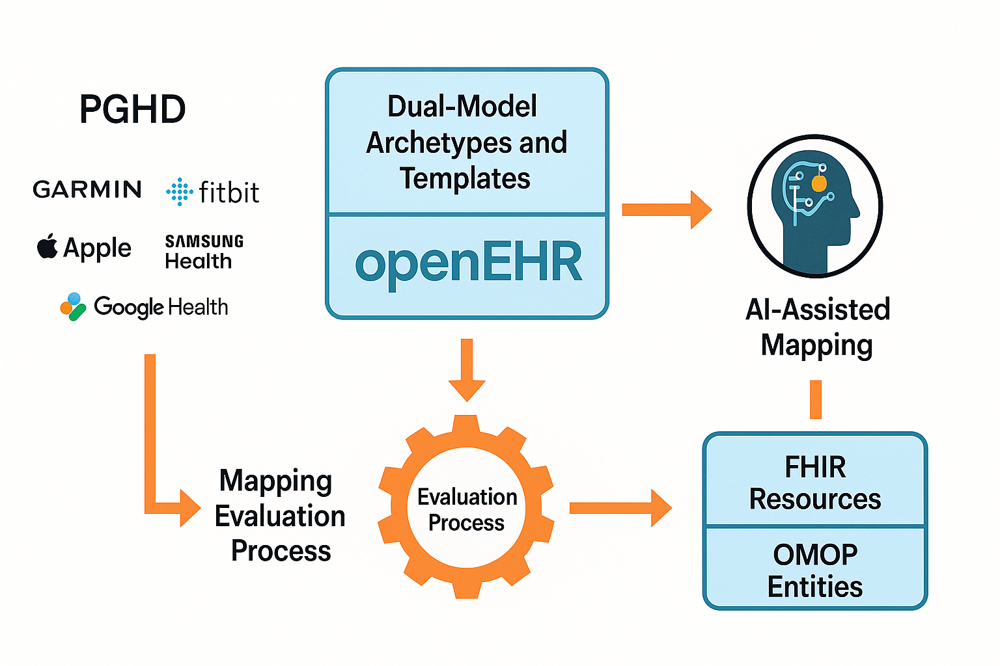

# About the Project

Patient-Generated Health Data (PGHD) represents a rapidly growing class of health information that offers unique perspectives on individuals’ health beyond clinical encounters. These data, often collected via wearables and mobile devices, provide rich context for personalized care. Despite their growing clinical and research value, PGHD are rarely structured or standardized in a way that allows for direct integration into Personal Electronic Health Records (EHRs) or clinical decision-making systems.

This project introduces a novel approach to modeling core PGHD concepts using openEHR's dual-model architecture as a foundation. By identifying and analyzing the data blocks and structural units that constitute PGHD (such as activity, sleep, heart rate), the project aims to semantically model them once in openEHR. These models will then be intelligently transformed into FHIR resources and OMOP CDM entities using AI-based semantic mapping techniques.

This strategy supports a unified, reusable model for PGHD that can bridge the gap between standards and use cases, whether the goal is primary care integration (via openEHR or FHIR standards) or secondary data analysis (via OMOP). Leveraging openEHR’s strong semantic expressiveness and alignment with clinical thinking, this work proposes a scalable pathway for standardizing PGHD and facilitating its joint utilization across ecosystems.

