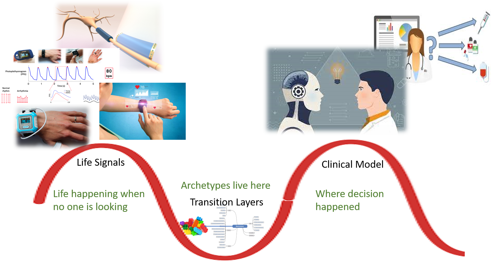

# Reflective Journal No. 2 — Between Data and Life

I was genuinely disappointed that I couldn’t attend the Barcelona conference-EHRCON25 because of previously arranged commitments. I followed the updates as they came out, and I could see how much meaningful exchange was happening there — especially around real-world data workflows and patient-centered digital health. I felt like I should have been there, not only listening but *participating*. This feeling stayed with me. It reminded me that the work I am doing is not isolated — it is part of an active, evolving conversation.

When I continued working with Patient-Generated Health Data, I began to notice something very clearly: PGHD is not just “more data” that we attach to electronic health records. It is a different language.

There are two languages always present:

- The language of everyday life: walking, resting, sleeping lightly, feeling tired, pushing through a busy day.
- The language of clinical systems: Observation, Evaluation, coded fields, structured units.

Life moves in continuity.  
Systems record in fragments.

The body expresses itself through rhythms.  
The record captures it in discrete entries.

I realized that my work is *in the space between these two* — translating one language into the other. 

    

---

## Working with the Data

The dataset I explored included:

- Steps  
- Heart rate  
- Sleep stages  
- Stress / HRV  
- Energy or recovery index 
- SPO2 and .... 

At first, these appear simple — “just numbers.”  
But very quickly it became clear that numbers alone do not carry meaning.

For example:

**Steps** can be daily totals, minute-level counts, or intensity-based activity scoring.  
**Heart rate** may be instantaneous, averaged, filtered, or algorithmically smoothed.  
**Sleep staging** is not direct measurement — it is algorithmic inference that can change after firmware updates.

This revealed something important:

> The quality of wearable data is shaped not only by the sensor, but by the algorithm interpreting it.

Two people wearing the same device under identical circumstances can end up with different patterns.  
And the same device can behave differently after a software update.

Meaning requires context.

---

## Why These Variables (For Now)

There are many other signals available — SpO₂, respiration rate, environmental indicators, PROMs, PREMs, etc.

The decision to begin with the selected variables was *intentional*:

- They vary meaningfully in everyday life  
- They can inform how someone is doing over time  
- They can be mapped and represented consistently at this stage  

Other elements will be added **gradually**, with **supervisor input** and **clinical interpretation support**, as the modeling process continues.

This is not *omission* — it is **phasing**.

---

## Where I Am in the Work

My role is becoming clearer:

It is not just about designing structures.  
Not just mapping openEHR to FHIR.  
Not just transforming models.

It is about:

- Identifying which signals truly matter  
- Understanding what they express in real life  
- Preserving that meaning when translating it into a structured clinical form  

This work is technical on the outside —  
but from within, it feels like *listening*:

Listening to the body,  
to behavior,  
to context,  
and then translating that into a language the system understands.

I am still standing on that bridge:

* Between life and system. 🌉
* Between rhythm and structure. 🌱
* Between meaning and measurement. 🧭

And for now — this is exactly where I need to be 
